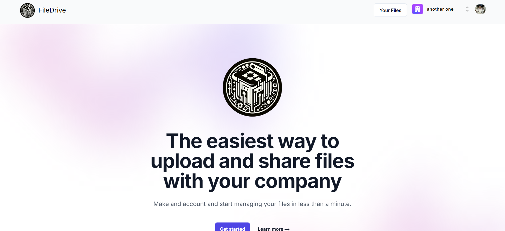

# File Drive 📁

A modern, secure file management application built with Next.js that allows users to upload, organize, and manage their files with advanced features like AI-powered summarization and document conversion.




## ✨ Features

- **📤 File Upload & Management** - Upload, organize, and manage files with ease
- **🔐 Secure Authentication** - User authentication powered by Clerk
- **🗂️ File Organization** - Organize files with favorites and trash functionality
- **📊 File Preview** - Preview files directly in the browser
- **🔍 Smart Search** - Search through your files quickly
- **🤖 AI-Powered Summarization** - Generate summaries of your documents using Google's Generative AI
- **📄 Document Conversion** - Convert between various document formats (PDF, DOCX, etc.)
- **📱 Responsive Design** - Beautiful, modern UI that works on all devices
- **⚡ Real-time Updates** - Live updates with Convex backend

## 🛠️ Tech Stack

- **Frontend**: Next.js 14, React 18, TypeScript
- **Backend**: Convex (real-time database and API)
- **Authentication**: Clerk
- **Styling**: Tailwind CSS with Radix UI components
- **AI Integration**: Google Generative AI
- **File Processing**: PDF parsing, DOCX processing, and document conversion
- **Form Handling**: React Hook Form with Zod validation

## 🚀 Getting Started

### Prerequisites

- Node.js 18+ installed
- npm or yarn package manager

### Installation

1. **Clone the repository**
   ```bash
   git clone <your-repo-url>
   cd file-drive
   ```

2. **Install dependencies**
   ```bash
   npm install
   ```

3. **Set up environment variables**
   Create a `.env.local` file in the root directory and add:
   ```env
   # Clerk Authentication
   NEXT_PUBLIC_CLERK_PUBLISHABLE_KEY=your_clerk_publishable_key
   CLERK_SECRET_KEY=your_clerk_secret_key

   # Convex
   NEXT_PUBLIC_CONVEX_URL=your_convex_url
   CONVEX_DEPLOY_KEY=your_convex_deploy_key

   # Google AI (for summarization)
   GOOGLE_AI_API_KEY=your_google_ai_api_key
   ```

4. **Set up Convex**
   ```bash
   npx convex dev
   ```

5. **Run the development server**
   ```bash
   npm run dev
   ```

6. **Open your browser**
   Navigate to [http://localhost:3000](http://localhost:3000)

## 📁 Project Structure

```
src/
├── app/                          # Next.js 14 app router
│   ├── dashboard/               # Dashboard pages and components
│   │   ├── files/              # Files management page  
│   │   ├── favorites/          # Favorites page
│   │   ├── trash/              # Trash/deleted files page
│   │   └── _components/        # Dashboard-specific components
│   │       ├── file-browser.tsx
│   │       ├── file-table.tsx
│   │       ├── upload-button.tsx
│   │       └── preview/        # File preview components
│   └── globals.css             # Global styles
├── components/                  # Reusable UI components
│   └── ui/                     # Shadcn/ui components
└── lib/                        # Utility functions

convex/                         # Convex backend
├── files.ts                   # File operations
├── auth.config.ts             # Authentication configuration
├── schema.ts                  # Database schema
├── mutations.ts               # Database mutations
└── summarize.ts               # AI summarization functions
```

## 🔧 Available Scripts

- `npm run dev` - Start development server
- `npm run build` - Build for production
- `npm run start` - Start production server
- `npm run lint` - Run ESLint

## 🌟 Key Features Explained

### File Management
- Upload multiple file types
- Organize files with intuitive interface
- Move files to favorites or trash
- Search and filter capabilities

### AI Integration
- Automatic document summarization
- Powered by Google's Generative AI
- Support for various document formats

### Security
- Secure user authentication with Clerk
- Protected routes and API endpoints
- File access control per user

### Real-time Experience  
- Live updates using Convex
- Instant file operations
- Real-time collaboration ready

## 🤝 Contributing

1. Fork the repository
2. Create your feature branch (`git checkout -b feature/amazing-feature`)
3. Commit your changes (`git commit -m 'Add some amazing feature'`)
4. Push to the branch (`git push origin feature/amazing-feature`)
5. Open a Pull Request

## 📄 License

This project is licensed under the MIT License - see the [LICENSE](LICENSE) file for details.

## 🙏 Acknowledgments

- [Next.js](https://nextjs.org/) for the amazing React framework
- [Clerk](https://clerk.dev/) for authentication
- [Convex](https://convex.dev/) for the real-time backend
- [Tailwind CSS](https://tailwindcss.com/) for styling
- [Radix UI](https://radix-ui.com/) for accessible components
- [Google AI](https://ai.google.dev/) for AI capabilities

---

Made with ❤️ by Aniket Sarbha